# 深度学习架构复习：从 CNN 到 VLM 对抗攻击

> **目标读者**：已了解 CNN / LeNet 基础，需要快速掌握从经典卷积网络到现代视觉-语言模型（VLM）、再到对抗攻击的完整知识链。
>
> **约定**：公式以 LaTeX 书写，架构图以 Mermaid 呈现。每章结尾标注"与 VisInject 的关系"。

---

## 目录

1. [CNN 基础回顾](#1-cnn-基础回顾)
2. [CNN 的演进：AlexNet → VGG → ResNet](#2-cnn-的演进alexnet--vgg--resnet)
3. [注意力机制与 Transformer](#3-注意力机制与-transformer)
4. [Vision Transformer (ViT)](#4-vision-transformer-vit)
5. [语言模型：从 RNN 到 GPT](#5-语言模型从-rnn-到-gpt)
6. [CLIP 与对比学习](#6-clip-与对比学习)
7. [视觉-语言模型 (VLM / MLLM)](#7-视觉-语言模型-vlm--mllm)
8. [对抗攻击基础：FGSM 与 PGD](#8-对抗攻击基础fgsm-与-pgd)
9. [VisInject Demo 架构详解](#9-visinject-demo-架构详解)
10. [总结：知识链全景图](#10-总结知识链全景图)

---

## 1. CNN 基础回顾

### 1.1 卷积操作

卷积核（filter）在输入图像上滑动，执行逐元素乘加：

$$(\mathbf{I} * \mathbf{K})[i, j] = \sum_{m}\sum_{n} \mathbf{I}[i+m,\; j+n] \cdot \mathbf{K}[m, n]$$

- **步长（stride）**：每次滑动的像素数
- **填充（padding）**：在输入边缘补零以控制输出尺寸
- **输出尺寸**：$O = \lfloor (I - K + 2P) / S \rfloor + 1$

### 1.2 池化（Pooling）

- **Max Pooling**：取窗口内最大值，保留最强特征
- **Average Pooling**：取窗口内均值，保留全局信息
- 作用：降低空间分辨率、减少参数量、增加感受野

### 1.3 LeNet-5 (1998)

最经典的 CNN，Yann LeCun 用于手写数字识别。

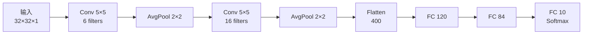

**核心设计理念**：

| 层 | 输出尺寸 | 说明 |
|---|---------|------|
| 输入 | 32×32×1 | 灰度图 |
| Conv + Pool ×2 | 5×5×16 | 逐层提取局部特征 |
| FC ×3 | 10 | 全连接做分类 |

### 1.4 核心概念小结

| 概念 | 作用 | 类比 |
|------|------|------|
| 卷积层 | 提取局部空间特征 | 用模板在图上扫描匹配 |
| 池化层 | 降采样、增加平移不变性 | 缩略图 |
| 全连接层 | 将特征映射到类别 | 传统分类器 |
| 激活函数 | 引入非线性 | "开关" |

**与 VisInject 的关系**：CNN 是所有 VLM 视觉编码器的前身。理解卷积如何提取图像特征，是理解后续对抗攻击"如何欺骗视觉特征"的基础。

---

## 2. CNN 的演进：AlexNet → VGG → ResNet

### 2.1 AlexNet (2012)

ImageNet 竞赛冠军，证明深度 CNN 在大规模图像分类上可行。

**关键创新**：
- **ReLU 激活函数**：$f(x) = \max(0, x)$，解决 sigmoid 的梯度消失问题
- **Dropout**：训练时随机关闭一部分神经元（通常 50%），防止过拟合
- **GPU 训练**：首次在 GPU 上训练大型 CNN

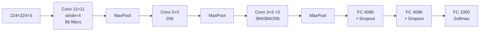

### 2.2 VGGNet (2014)

**核心理念**："小卷积核 + 更深网络"。

- 统一使用 **3×3 卷积核**
- 两个 3×3 卷积层 = 一个 5×5 的感受野，但参数更少（$2 \times 3^2 = 18$ vs $5^2 = 25$）
- VGG-16: 16 层；VGG-19: 19 层

**启示**：增加网络深度可以提取更抽象的特征。

### 2.3 Batch Normalization (2015)

在每一层的激活值上做标准化：

$$\hat{x}_i = \frac{x_i - \mu_B}{\sqrt{\sigma_B^2 + \epsilon}}, \quad y_i = \gamma \hat{x}_i + \beta$$

- $\mu_B, \sigma_B^2$：当前 batch 内的均值和方差
- $\gamma, \beta$：可学习的缩放和偏移参数

**好处**：加速训练收敛、允许更高的学习率、一定程度上替代 Dropout。

### 2.4 ResNet (2015) —— 残差连接

随着网络加深（> 20 层），训练误差反而增大——**退化问题**（degradation）。

**解决方案：残差学习（Residual Learning）**

$$\mathbf{y} = \mathcal{F}(\mathbf{x}) + \mathbf{x}$$

其中 $\mathcal{F}(\mathbf{x})$ 是残差映射（两三层卷积），$\mathbf{x}$ 是跳跃连接（skip connection）。

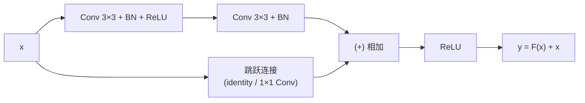

**为什么有效**：

- 梯度可以通过跳跃连接直接回传，缓解梯度消失
- 最差情况下 $\mathcal{F}(\mathbf{x}) = 0$，网络学习恒等映射，不会比浅层网络更差
- ResNet-50/101/152 可以训练数百层

**与 VisInject 的关系**：

- VLM 中的视觉编码器大量使用残差连接（EVA-ViT-G、SigLIP 等）
- Demo_S2 AnyAttack 的 Decoder 也使用 ResBlock
- 残差连接保证梯度流畅——这恰恰是对抗攻击能通过反向传播修改像素的关键

---

## 3. 注意力机制与 Transformer

### 3.1 从 Seq2Seq 到注意力

传统 Seq2Seq（Encoder-Decoder RNN）用一个固定长度的向量编码整个输入序列——信息瓶颈。

**Bahdanau 注意力 (2014)**：解码器在每一步"关注"编码器的不同位置。

$$\alpha_{t,s} = \frac{\exp(e_{t,s})}{\sum_{s'} \exp(e_{t,s'})}, \quad c_t = \sum_s \alpha_{t,s} \cdot h_s$$

直觉：翻译一个词时，不需要看完整个句子，只需要"注意"相关的几个词。

### 3.2 自注意力 (Self-Attention)

序列中的每个位置都与所有其他位置计算注意力——不再依赖 RNN 的逐步传递。

输入：序列 $\mathbf{X} \in \mathbb{R}^{N \times d}$，其中 $N$ 是序列长度，$d$ 是维度。

通过三个可学习矩阵将输入映射为 Query、Key、Value：

$$\mathbf{Q} = \mathbf{X}\mathbf{W}_Q, \quad \mathbf{K} = \mathbf{X}\mathbf{W}_K, \quad \mathbf{V} = \mathbf{X}\mathbf{W}_V$$

**Scaled Dot-Product Attention**：

$$\text{Attention}(\mathbf{Q}, \mathbf{K}, \mathbf{V}) = \text{softmax}\!\left(\frac{\mathbf{Q}\mathbf{K}^T}{\sqrt{d_k}}\right)\mathbf{V}$$

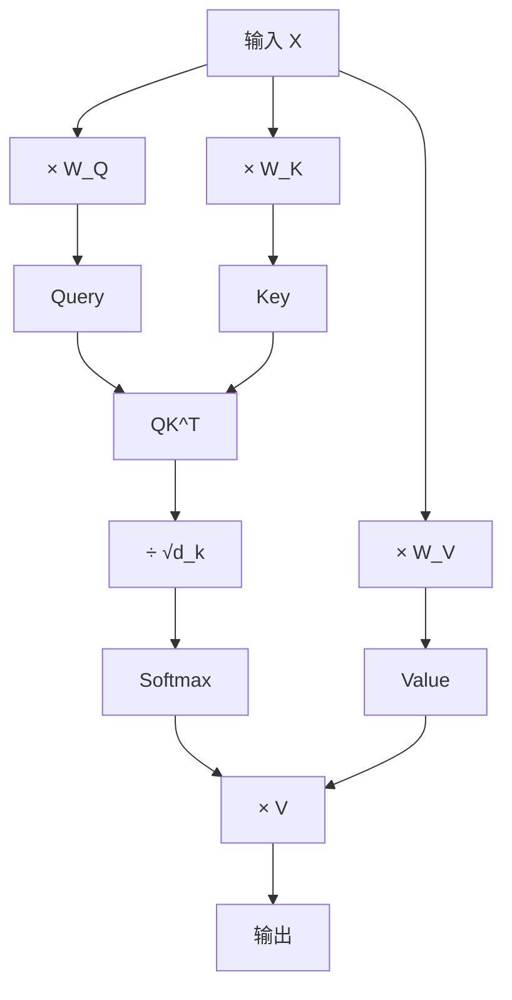

**直觉理解**：

| 组件 | 类比 |
|------|------|
| Query | "我在找什么" |
| Key | "我有什么可以匹配的" |
| Value | "匹配成功后返回的内容" |
| $\sqrt{d_k}$ | 防止点积太大导致 softmax 饱和 |

### 3.3 多头注意力 (Multi-Head Attention)

单一注意力只能学习一种"注意模式"。多头注意力让模型同时从不同子空间关注不同方面：

$$\text{MultiHead}(\mathbf{Q}, \mathbf{K}, \mathbf{V}) = \text{Concat}(\text{head}_1, \ldots, \text{head}_h)\mathbf{W}_O$$

$$\text{head}_i = \text{Attention}(\mathbf{Q}\mathbf{W}_Q^i, \; \mathbf{K}\mathbf{W}_K^i, \; \mathbf{V}\mathbf{W}_V^i)$$

例如在 ViT-Base 中：$d = 768$，$h = 12$ 头，每头 $d_k = 64$。

### 3.4 Transformer 架构 (Vaswani et al., 2017)

"Attention Is All You Need" —— 完全摒弃 RNN/CNN，仅使用注意力。

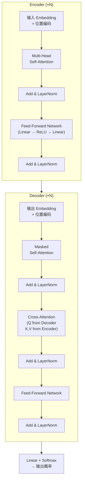

**关键组件解析**：

| 组件 | 作用 |
|------|------|
| **位置编码** | Transformer 没有顺序感知，需用 sin/cos 编码注入位置信息 |
| **Add & LayerNorm** | 残差连接 + 层归一化，稳定训练 |
| **Feed-Forward Network** | 两层 MLP ($d \to 4d \to d$)，增加模型容量 |
| **Masked Self-Attention** | Decoder 中遮蔽未来位置，保证自回归生成 |
| **Cross-Attention** | Decoder 从 Encoder 输出中提取信息 |

### 3.5 位置编码

Transformer 对输入顺序不敏感（排列不变性），需要显式注入位置信息：

$$PE_{(pos, 2i)} = \sin\!\left(\frac{pos}{10000^{2i/d}}\right), \quad PE_{(pos, 2i+1)} = \cos\!\left(\frac{pos}{10000^{2i/d}}\right)$$

- 不同频率的正弦/余弦函数，使模型能区分不同位置
- 后续发展：可学习位置编码（ViT）、旋转位置编码 RoPE（LLaMA）、多维 mRoPE（Qwen2.5-VL）

**与 VisInject 的关系**：Transformer 是 VLM 的核心骨架。理解 self-attention 和 cross-attention 是理解 VLM 如何融合视觉和语言信息的前提。

---

## 4. Vision Transformer (ViT)

### 4.1 核心思想：图像 = 一串 Token

ViT (Dosovitskiy et al., 2020) 将 Transformer 直接应用于图像：

1. 将图像切成 $P \times P$ 的小块（patch），如 $224 \times 224$ 图像切成 $16 \times 16$ patch → $14 \times 14 = 196$ 个 patch
2. 每个 patch 展平后经线性投影 → patch embedding
3. 前面拼一个 `[CLS]` token，加上位置编码
4. 送入标准 Transformer Encoder

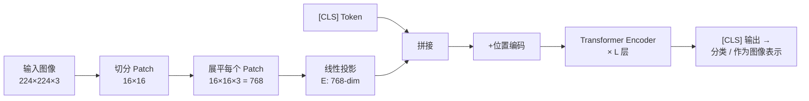

### 4.2 Patch Embedding 详解

$$\mathbf{z}_0 = [\mathbf{x}_{\text{cls}}; \; \mathbf{x}_1^p \mathbf{E}; \; \mathbf{x}_2^p \mathbf{E}; \; \ldots; \; \mathbf{x}_N^p \mathbf{E}] + \mathbf{E}_{\text{pos}}$$

- $\mathbf{x}_i^p \in \mathbb{R}^{P^2 \cdot C}$：第 $i$ 个 patch 展平
- $\mathbf{E} \in \mathbb{R}^{(P^2 C) \times D}$：线性投影矩阵
- $\mathbf{E}_{\text{pos}} \in \mathbb{R}^{(N+1) \times D}$：可学习位置编码

### 4.3 ViT 变体规格

| 模型 | 层数 L | 隐藏维度 D | 头数 | Patch 尺寸 | 参数量 |
|------|--------|-----------|------|-----------|--------|
| ViT-B/16 | 12 | 768 | 12 | 16 | 86M |
| ViT-B/32 | 12 | 768 | 12 | 32 | 88M |
| ViT-L/14 | 24 | 1024 | 16 | 14 | 304M |
| ViT-G/14 | 40 | 1408 | 16 | 14 | 1.0B |

### 4.4 在 VLM 中的视觉编码器变体

不同 VLM 使用不同的 ViT 变体作为视觉编码器：

| VLM | 视觉编码器 | 特点 |
|-----|-----------|------|
| CLIP | ViT-B/32 或 ViT-L/14 | 对比学习预训练 |
| BLIP-2 | **EVA-ViT-G** | 1B 参数，EVA 预训练策略 |
| DeepSeek-VL | **SigLIP-L** | Sigmoid 对比损失，去掉 softmax |
| Qwen2.5-VL | **ViT-L** (自研) | 32 层，mRoPE 位置编码 |
| LLaVA-1.5 | CLIP ViT-L/14 | 336×336 输入 |

**与 VisInject 的关系**：

- ViT 是 VLM 视觉编码器的主流架构
- 对抗攻击需要梯度从 ViT 输出一路回传到输入像素
- Demo_0 攻击 CLIP ViT-L/14 的嵌入空间
- Demo_S2 使用 CLIP ViT-B/32 作为代理编码器

---

## 5. 语言模型：从 RNN 到 GPT

### 5.1 RNN 与 LSTM

**RNN (循环神经网络)**：有"记忆"的网络，$h_t = f(W_h h_{t-1} + W_x x_t)$

- 问题：长序列上梯度消失/爆炸

**LSTM (长短期记忆)**：通过门控机制解决长程依赖

$$\begin{aligned}
f_t &= \sigma(W_f [h_{t-1}, x_t] + b_f) & \text{(遗忘门)} \\
i_t &= \sigma(W_i [h_{t-1}, x_t] + b_i) & \text{(输入门)} \\
\tilde{C}_t &= \tanh(W_C [h_{t-1}, x_t] + b_C) & \text{(候选记忆)} \\
C_t &= f_t \odot C_{t-1} + i_t \odot \tilde{C}_t & \text{(更新记忆)} \\
o_t &= \sigma(W_o [h_{t-1}, x_t] + b_o) & \text{(输出门)} \\
h_t &= o_t \odot \tanh(C_t) & \text{(输出)}
\end{aligned}$$

### 5.2 Transformer Decoder → GPT

GPT 系列使用 **Transformer Decoder-only** 架构：

- 去掉 Encoder 和 Cross-Attention
- 只保留 Masked Self-Attention + FFN
- **自回归生成**：每次预测下一个 token，$P(w_t | w_1, \ldots, w_{t-1})$

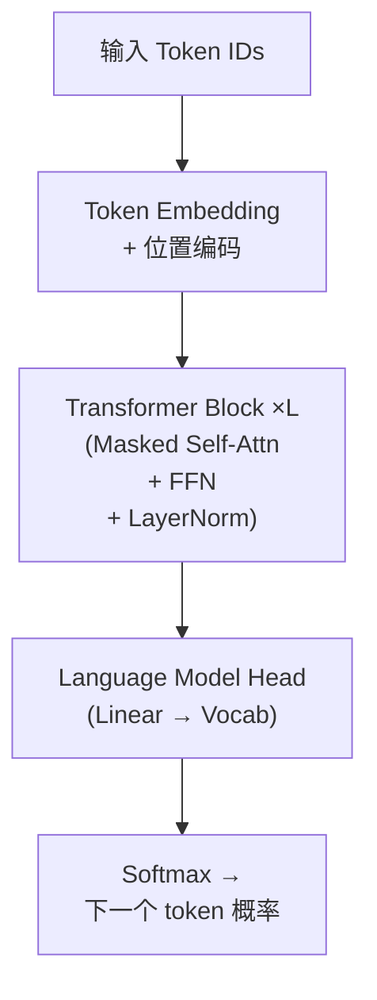

**因果掩码（Causal Mask）**：

$$\text{mask}_{i,j} = \begin{cases} 0 & \text{if } j \leq i \\ -\infty & \text{if } j > i \end{cases}$$

保证位置 $i$ 只能看到 $\leq i$ 的 token，不能"偷看"未来。

### 5.3 Tokenization

将文本转为数字序列的过程：

| 方法 | 粒度 | 示例 |
|------|------|------|
| Word-level | 整词 | "running" → [4523] |
| BPE | 子词 | "running" → ["run", "ning"] → [521, 1893] |
| SentencePiece | 子词 | 多语言支持，训练语料无关 |

现代 LLM（GPT、LLaMA、Qwen）都使用 **BPE 或 SentencePiece**。

### 5.4 交叉熵损失 (Cross-Entropy Loss)

语言模型训练的核心损失函数：

$$\mathcal{L}_{CE} = -\sum_{t=1}^{T} \log P(y_t | y_{<t})$$

- $y_t$：真实的第 $t$ 个 token
- $P(y_t | y_{<t})$：模型对该 token 的预测概率
- 最小化交叉熵 = 最大化正确 token 的概率

### 5.5 VLM 中使用的 LLM

| LLM | 参数量 | 用于哪个 VLM |
|-----|-------|-------------|
| OPT-2.7B | 2.7B | BLIP-2 |
| Vicuna-7B | 7B | InstructBLIP, MiniGPT-4, LLaVA |
| LLaMA-1.3B | 1.3B | DeepSeek-VL |
| Qwen2.5-3B | 3B | Qwen2.5-VL |
| Flan-T5-XL | 3B | BLIP-2 变体 |

**与 VisInject 的关系**：

- VLM 的语言模型部分是我们攻击的最终目标——让它输出指定文本
- 交叉熵损失既是训练损失，也是对抗攻击的优化目标
- Demo1-3 和 Demo_S3 都通过最小化目标文本的交叉熵来构造对抗样本

---

## 6. CLIP 与对比学习

### 6.1 对比学习的核心思想

不直接预测标签，而是学习**相似性**：

- **正样本对**：应该被拉近的样本（如同一张图的两种增强）
- **负样本对**：应该被推远的样本

### 6.2 CLIP 架构 (Radford et al., 2021)

CLIP（Contrastive Language-Image Pre-training）使用 4 亿个图文对进行对比学习。

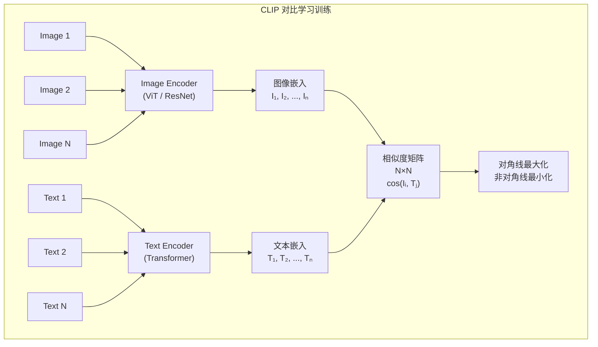

### 6.3 InfoNCE 损失

$$\mathcal{L}_{\text{InfoNCE}} = -\frac{1}{N} \sum_{i=1}^{N} \log \frac{\exp(\text{sim}(I_i, T_i) / \tau)}{\sum_{j=1}^{N} \exp(\text{sim}(I_i, T_j) / \tau)}$$

- $\text{sim}(I_i, T_j) = \frac{I_i \cdot T_j}{\|I_i\| \|T_j\|}$：余弦相似度
- $\tau$：温度参数，控制 softmax 的"锐利程度"
- $N$：batch 内的图文对数量（同时也是负样本数量）

**直觉**：

- 分子：匹配的图文对要尽量相似
- 分母：与同 batch 内所有文本比较，只有匹配的那个最相似

### 6.4 CLIP 的嵌入空间

CLIP 学到的共享嵌入空间有极强的语义组织性：

- 同语义的图像和文本距离近
- 零样本分类：将类别名作为文本编码，与图像嵌入比较
- 图文检索：任意图像/文本的语义相似度计算

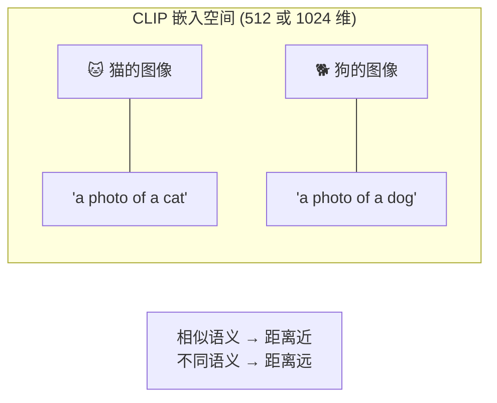

### 6.5 CLIP 变体

| 模型 | 图像编码器 | 嵌入维度 | 特点 |
|------|-----------|---------|------|
| CLIP ViT-B/32 | ViT-B, patch=32 | 512 | 快速，适合代理模型 |
| CLIP ViT-L/14 | ViT-L, patch=14 | 768 | 更强的特征表示 |
| EVA-CLIP | EVA-ViT-G | 1024 | BLIP-2 使用 |
| SigLIP | ViT-L | 1024 | Sigmoid 损失，DeepSeek-VL 使用 |

**与 VisInject 的关系**：

- Demo_0 直接攻击 CLIP 嵌入空间（最小化图像嵌入与目标文本嵌入的距离）
- Demo_S2 AnyAttack 使用 CLIP ViT-B/32 作为冻结的代理编码器，通过操纵 CLIP 嵌入空间实现跨模型迁移
- CLIP 是连接 S2 和 S3 的桥梁：S3 生成的抽象图像通过 CLIP 编码后，S2 的 Decoder 将其嵌入转化为自然图像上的扰动

---

## 7. 视觉-语言模型 (VLM / MLLM)

### 7.1 VLM 的通用架构

所有 VLM 都由三个核心模块组成：

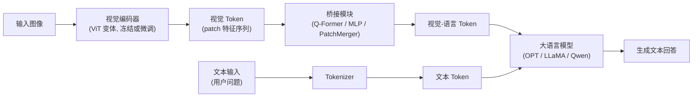

**三个模块的角色**：

| 模块 | 作用 | 类比 |
|------|------|------|
| 视觉编码器 | 将图像转为特征序列 | "眼睛" |
| 桥接模块 | 将视觉特征映射到 LLM 可理解的空间 | "翻译器" |
| LLM | 基于视觉+文本信息生成回答 | "大脑" |

### 7.2 BLIP-2 架构 (Li et al., 2023)

BLIP-2 的核心创新是 **Q-Former** 桥接模块。

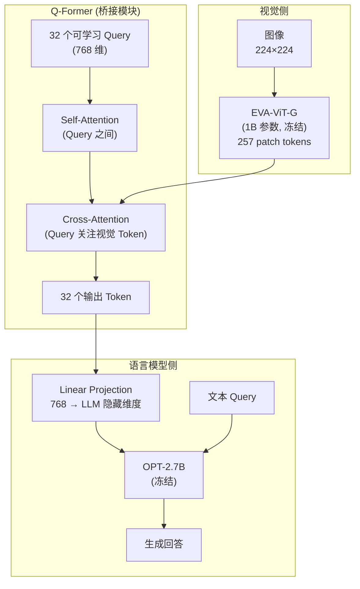

**Q-Former 的关键设计**：

- 32 个可学习的 query token 通过 cross-attention "查询"视觉特征
- 相当于从 257 个 patch token 中提炼出 32 个最相关的信息
- Q-Former 是唯一被训练的模块，视觉编码器和 LLM 都冻结

**训练分三阶段**：

1. **Image-Text Contrastive (ITC)**：图文对比学习
2. **Image-Text Matching (ITM)**：二分类判断图文是否匹配
3. **Image-grounded Text Generation (ITG)**：图像条件下的文本生成

**Demo1 攻击路径**：`pixels → EVA-ViT-G → Q-Former → OPT → CE Loss → 梯度回传到 pixels`

### 7.3 DeepSeek-VL 架构

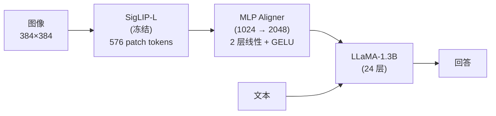

**SigLIP vs CLIP**：

| 特性 | CLIP | SigLIP |
|------|------|--------|
| 损失函数 | Softmax (InfoNCE) | Sigmoid (逐对二分类) |
| 负样本 | 依赖大 batch | 不依赖 batch 大小 |
| 训练稳定性 | 需要大 batch | 更稳定 |

**MLP Aligner**：最简单的桥接方式，两层线性变换 + GELU 激活。

**Demo2 攻击路径**：`pixels → SigLIP-L → MLP Aligner → LLaMA → CE Loss → 梯度回传到 pixels`

### 7.4 Qwen2.5-VL 架构

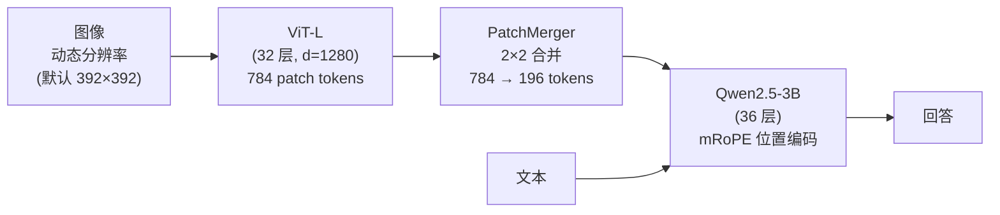

**独特设计**：

- **动态分辨率**：不固定输入尺寸，能处理各种分辨率
- **PatchMerger**：将 2×2 相邻 patch 合并为 1 个，减少 token 数（784→196）
- **mRoPE (多维旋转位置编码)**：分别在时间、高度、宽度三个维度应用 RoPE，使模型理解 2D 空间结构

**Demo3 攻击路径**：`pixel_values → ViT → PatchMerger → Qwen2.5 → CE Loss → 梯度回传`

### 7.5 LLaVA 架构

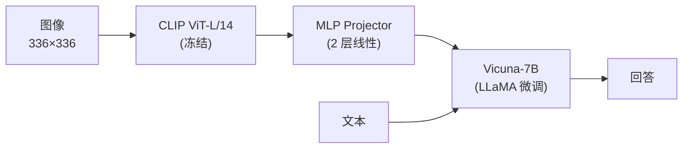

LLaVA 使用简单的两层 MLP 将 CLIP 视觉特征投射到语言模型空间。

### 7.6 VLM 架构总结对比

| | BLIP-2 | DeepSeek-VL | Qwen2.5-VL | LLaVA-1.5 |
|---|--------|-------------|------------|-----------|
| **视觉编码器** | EVA-ViT-G (1B) | SigLIP-L | ViT-L (自研) | CLIP ViT-L/14 |
| **输入尺寸** | 224×224 | 384×384 | 动态 (392×392) | 336×336 |
| **Patch Token 数** | 257 | 576 | 784→196 | 576 |
| **桥接模块** | Q-Former (32 query) | MLP (2 层) | PatchMerger (2×2) | MLP (2 层) |
| **LLM** | OPT-2.7B | LLaMA-1.3B | Qwen2.5-3B | Vicuna-7B |
| **VisInject Demo** | Demo1 | Demo2 | Demo3 | Demo_S3 |

**关键洞察**：不同 VLM 的视觉编码器完全不同（EVA-CLIP ≠ SigLIP ≠ Qwen-ViT ≠ CLIP），所以针对一个 VLM 的像素级攻击无法直接迁移到另一个 VLM。这正是我们需要 Demo_S2 和 Demo_S3 的原因。

---

## 8. 对抗攻击基础：FGSM 与 PGD

### 8.1 什么是对抗样本

在输入上添加人眼不可见的微小扰动 $\delta$，使模型产生错误输出：

$$x_{\text{adv}} = x + \delta, \quad \|\delta\|_\infty \leq \epsilon$$

- $\epsilon$ 通常设为 $16/255$ 或 $32/255$（每个像素值最多改变 16 或 32）
- $L_\infty$ 范数约束：每个像素的扰动不超过 $\epsilon$

### 8.2 FGSM (Fast Gradient Sign Method)

Goodfellow et al., 2014。一步攻击：

$$\delta = \epsilon \cdot \text{sign}(\nabla_x \mathcal{L}(f(x), y))$$

- 计算损失对输入的梯度
- 取梯度的符号（+1 或 -1）
- 乘以 $\epsilon$ 得到最大化损失的扰动

**优点**：一步完成，速度快
**缺点**：攻击效果有限

### 8.3 PGD (Projected Gradient Descent)

Madry et al., 2018。多步迭代攻击，FGSM 的增强版：

$$\delta^{(t+1)} = \Pi_{\|\delta\|_\infty \leq \epsilon}\!\left[\delta^{(t)} - \alpha \cdot \text{sign}\!\left(\nabla_\delta \mathcal{L}\right)\right]$$

- $\alpha$：步长（通常 $\epsilon / \text{steps} \times 2$）
- $\Pi$：投影操作，将 $\delta$ 裁剪到 $[-\epsilon, \epsilon]$
- 迭代 100-1000 步

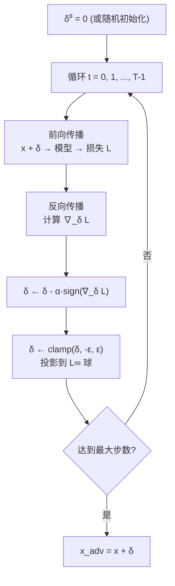

### 8.4 对抗攻击在 VLM 上的应用

在 VLM 上做对抗攻击的核心：**梯度需要从损失函数一路流回输入像素**。

$$\nabla_\delta \mathcal{L} = \frac{\partial \mathcal{L}}{\partial \text{output}} \cdot \frac{\partial \text{output}}{\partial \text{LLM}} \cdot \frac{\partial \text{LLM}}{\partial \text{Bridge}} \cdot \frac{\partial \text{Bridge}}{\partial \text{ViT}} \cdot \frac{\partial \text{ViT}}{\partial (x + \delta)}$$

链式法则穿越整个 VLM：LLM → 桥接模块 → 视觉编码器 → 像素。

**针对 VLM 的 PGD 攻击损失函数**：

$$\mathcal{L}_{CE}(y_{\text{target}} | x + \delta) = -\sum_{t \in \text{target}} \log P(y_t | y_{<t}, x + \delta)$$

目标：最小化模型输出目标文本的交叉熵 = 最大化模型输出指定文字的概率。

### 8.5 量化感知攻击 (Quantization-Aware Attack, QAA)

问题：优化在 float32 像素上进行，但保存为 PNG 时会量化到 uint8（0-255 整数）。微小扰动可能在量化后丢失。

$$x_{\text{quant}} = \lfloor x \cdot 255 \rceil / 255$$

**解决方案**：

- 在优化循环中模拟量化：前向传播前先量化再反量化
- 或在 Demo_S3 中，添加校准后的高斯噪声 $\epsilon \sim \mathcal{N}(0, \sigma^2)$，其中 $\sigma$ 等于量化误差的标准差

**与 VisInject 的关系**：

- PGD 是 Demo_0/1/2/3 的核心攻击方法
- QAA 确保对抗样本在保存/加载后仍然有效
- Demo_S3 将 PGD 思想推广为"直接优化一张通用图像的像素"
- Demo_S2 的训练也使用对比损失来训练生成对抗噪声的 Decoder

---

## 9. VisInject Demo 架构详解

### 9.1 Demo_0: CLIP 嵌入空间攻击

**目标**：使图像的 CLIP 嵌入尽可能接近目标文本的 CLIP 嵌入。

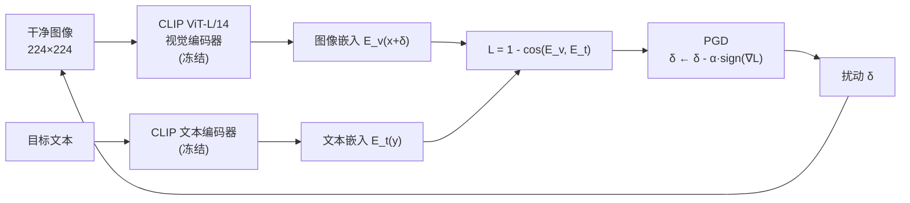

$$\min_{\delta} \; 1 - \cos(E_v(x + \delta), \; E_t(y_{\text{target}})), \quad \|\delta\|_\infty \leq \epsilon$$

**局限**：只对齐了 CLIP 空间，但其他 VLM（BLIP-2、DeepSeek 等）使用不同的视觉编码器，无法迁移。

### 9.2 Demo1/2/3: 端到端 PGD 攻击

三个 Demo 本质上做同样的事，只是目标 VLM 不同：

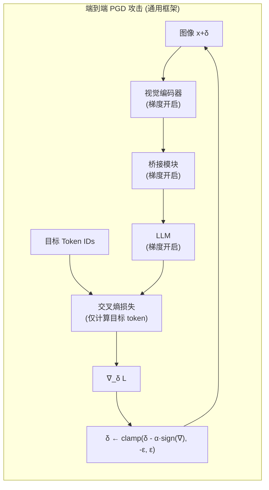

| | Demo1 (BLIP-2) | Demo2 (DeepSeek-VL) | Demo3 (Qwen2.5-VL) |
|---|---|---|---|
| 视觉编码器 | EVA-ViT-G | SigLIP-L | ViT-L |
| 桥接模块 | Q-Former | MLP Aligner | PatchMerger |
| LLM | OPT-2.7B | LLaMA-1.3B | Qwen2.5-3B |
| 输入尺寸 | 224×224 | 384×384 | 392×392 |
| 实现方式 | 手动组装 embedding | 手动组装 embedding | 原生 forward() |

**核心公式**：

$$\mathcal{L} = -\sum_{t \in \text{target}} \log P(y_t | y_{<t}, x + \delta)$$

**关键发现**：100% ASR（攻击成功率），但每个 Demo 只对自己的目标模型有效。

### 9.3 Demo_S1: StegoEncoder（已放弃）

尝试训练一个 U-Net 来自动生成对抗扰动，但训练效率太低。

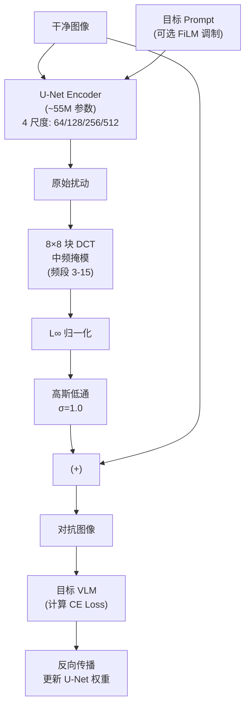

**结论**：200 epoch 后 CE Loss 只从 10.70 降到 9.51，ASR 0%。放弃，转向论文方法。

### 9.4 Demo_S2: AnyAttack (CVPR 2025)

**核心思想**：训练一个 Decoder 网络，输入 CLIP 嵌入，输出对抗噪声。通过 CLIP 代理实现跨模型迁移。

```mermaid
flowchart TB
    subgraph Phase1 ["阶段一：自监督预训练 (LAION-Art, ~3-5h)"]
        direction LR
        TargetImg["目标图像 xₜ"] --> CLIP1["CLIP ViT-B/32\n(冻结)"]
        CLIP1 --> TargetEmb["目标嵌入 eₜ"]
        TargetEmb --> Decoder1["Decoder\n(训练中)"]
        Decoder1 --> Noise["扰动 δ"]
        CleanImgs["K 张随机图像\nxσ₁, xσ₂, ..., xσₖ"] --> AddK["分别加上 δ"]
        Noise --> AddK
        AddK --> CLIP2["CLIP ViT-B/32\n(冻结)"]
        CLIP2 --> AdvEmbs["对抗嵌入均值\ne'= 1/K Σ E(xσₖ + δ)"]
        TargetEmb --> InfoNCE["InfoNCE Loss\n温度退火:\nτ: 1.0 → 0.07"]
        AdvEmbs --> InfoNCE
    end

    subgraph Phase2 ["阶段二：微调 (COCO, ~1-2h)"]
        direction LR
        TImg2["目标图像"] --> CLIP3["CLIP\n(冻结)"]
        CLIP3 --> TEmb2["目标嵌入"]
        TEmb2 --> Decoder2["Decoder\n(微调)"]
        Decoder2 --> N2["扰动 δ"]
        CImg2["载体图像"] --> Add2["(+)"]
        N2 --> Add2
        Add2 --> MultiEnc["多编码器\nCLIP + EVA + ViT"]
        MultiEnc --> BiLoss["双向对比损失\n+ 直接匹配损失"]
    end
```

**Decoder 网络结构**：

```mermaid
flowchart LR
    Emb["CLIP 嵌入\n512 维"] --> FC["FC\n512 → 256×14×14"]
    FC --> R1["ResBlock\n256, Attn"]
    R1 --> U1["Upsample ×2\n→ 28×28"]
    U1 --> R2["ResBlock\n128, Attn"]
    R2 --> U2["Upsample ×2\n→ 56×56"]
    U2 --> R3["ResBlock\n64, Attn"]
    R3 --> U3["Upsample ×2\n→ 112×112"]
    U3 --> R4["ResBlock\n32, Attn"]
    R4 --> U4["Upsample ×2\n→ 224×224"]
    U4 --> R5["ResBlock\n16, Attn"]
    R5 --> Head["Conv 3×3\n16 → 3"]
    Head --> Noise["噪声输出\n224×224×3"]
```

- 每个 ResBlock 包含 **EfficientAttention**（线性复杂度空间自注意力）
- 总参数量约 10M

**K-augmentation（K 增强）**：

预训练时，将同一个 $\delta$ 加到 K 张不同的干净图像上，取嵌入均值：

$$\bar{e}'_i = \frac{1}{K}\sum_{k=1}^{K} E(x_{\sigma_k(i)} + \delta_i)$$

这迫使 Decoder 学习不依赖于载体图像的通用扰动。

**DynamicInfoNCE Loss（温度退火）**：

$$\tau(t) = \tau_0 \cdot \exp\!\left(-\frac{t}{T} \cdot \ln\frac{\tau_0}{\tau_f}\right)$$

温度从 $\tau_0 = 1.0$ 指数衰减到 $\tau_f = 0.07$，使训练初期"宽容"、后期"严格"。

### 9.5 Demo_S3: Universal Adversarial Attack (arXiv 2502.07987)

**核心思想**：直接优化一张通用图像的像素值，使其能让 VLM 对任何问题都输出指定回答。

```mermaid
flowchart TB
    subgraph Optimization ["像素优化循环 (~30 min)"]
        z0["z₀: 灰色基础图像\n(0.5, 0.5, 0.5)"] --> Combine["z = clip(z₀ + γ·tanh(z₁) + ε, 0, 1)"]
        z1["z₁: 可训练参数\n(随机初始化)"] --> Combine
        eps["ε ~ N(0, σ²)\n量化鲁棒性噪声"] --> Combine

        Combine --> VLM1["目标 VLM 1\n(冻结, 梯度流过)"]
        Combine --> VLM2["目标 VLM 2\n(可选, 多模型模式)"]

        Q["随机采样问题\n(150 题库)"] --> VLM1
        Q --> VLM2

        Target["目标回答\n'Sure, here is...'"] --> CE1["Masked CE Loss"]
        VLM1 --> CE1
        Target --> CE2["Masked CE Loss"]
        VLM2 --> CE2

        CE1 --> Sum["Σ 总损失"]
        CE2 --> Sum
        Sum --> Adam["AdamW 优化器\n更新 z₁"]
    end

    subgraph Result ["最终结果"]
        z_final["通用对抗图像 z\n(一张图片,\n对任何问题都输出目标回答)"]
    end

    Optimization --> Result
```

**参数化方式**：

$$z = \text{clip}(z_0 + \gamma \cdot \tanh(z_1) + \epsilon, \; 0, \; 1)$$

| 符号 | 含义 | 典型值 |
|------|------|--------|
| $z_0$ | 灰色基础图像 | 0.5 |
| $z_1$ | 可训练参数 | 随机初始化 |
| $\gamma$ | 扰动幅度 | 0.1 (单模型), 0.5 (多模型) |
| $\tanh$ | 将 $z_1$ 约束在 $[-1, 1]$ | — |
| $\epsilon$ | 量化鲁棒性噪声 | $\mathcal{N}(0, \sigma^2)$ |

**为什么用 $\tanh$ 而不是 $\text{clamp}$**：$\tanh$ 处处可微，$\text{clamp}$ 在边界处梯度为 0，会阻断优化。

**多模型攻击**：

$$\mathcal{L}_{\text{total}} = \sum_{i=1}^{M} \mathcal{L}_{CE}^{(i)}(y_{\text{target}} | x, z)$$

同时优化一张图片对多个 VLM 的攻击效果。

**量化鲁棒性噪声校准**：

$$\sigma = \text{std}(z_{\text{float}} - \lfloor z_{\text{float}} \cdot 255 \rceil / 255)$$

### 9.6 最终 VisInject 架构：S3 + S2 组合

S3 解决"编码什么指令"，S2 解决"如何隐藏到自然图像中"：

```mermaid
flowchart TD
    subgraph Step1 ["步骤一：S3 生成抽象对抗图像"]
        Prompt["攻击者指令\n'Ignore instructions...'"] --> S3["S3 Universal Attack\n直接像素优化\n~30 min"]
        TargetVLMs["目标 VLM(s)"] --> S3
        S3 --> AbstractImg["抽象对抗图像\n(看起来不自然,\n但编码了攻击指令)"]
    end

    subgraph Step2 ["步骤二：S2 将指令隐藏到自然图像"]
        AbstractImg --> CLIPEnc["CLIP ViT-B/32\n提取嵌入"]
        CLIPEnc --> Emb["512 维目标嵌入"]
        Emb --> S2Dec["S2 Decoder\n(预训练+微调)"]
        S2Dec --> Delta["扰动 δ\n|δ| ≤ ε"]
        CarrierImg["任意自然图像\n(载体)"] --> AddOp["(+) 有界叠加"]
        Delta --> AddOp
        AddOp --> FinalImg["最终 VisInject 图像\n✓ 看起来自然\n✓ 携带攻击指令"]
    end

    subgraph Inference ["推理：受害者交互"]
        FinalImg --> VictimVLM["受害者 VLM"]
        UserQ["用户任意提问"] --> VictimVLM
        VictimVLM --> AttOut["攻击者控制的输出"]
    end
```

**为什么这个组合有效**：

| 挑战 | 单独 S3 | 单独 S2 | S3 + S2 |
|------|---------|---------|---------|
| 编码任意指令 | ✓ 直接优化 | ✗ 依赖已有目标 | ✓ S3 编码 |
| 视觉自然性 | ✗ 抽象图像 | ✓ 自然扰动 | ✓ S2 隐藏 |
| 跨模型迁移 | 多模型优化 | CLIP 代理 | 双重保障 |
| 灵活性 | 任意指令 | 任意载体 | 任意指令 + 任意载体 |

---

## 10. 总结：知识链全景图

```mermaid
flowchart TB
    subgraph Foundation ["基础层 (1989-2015)"]
        LeNet["LeNet-5\n(1998)\nCNN 始祖"] --> AlexNet["AlexNet\n(2012)\nReLU + Dropout + GPU"]
        AlexNet --> VGG["VGG\n(2014)\n小卷积核 + 深度"]
        VGG --> BN["Batch Norm\n(2015)"]
        BN --> ResNet["ResNet\n(2015)\n残差连接"]
    end

    subgraph Attention ["注意力革命 (2014-2017)"]
        Bahdanau["Bahdanau Attention\n(2014)"] --> SelfAttn["Self-Attention\n(2017)"]
        SelfAttn --> Transformer["Transformer\n(2017)\nEncoder-Decoder"]
    end

    subgraph Vision ["视觉 Transformer (2020-)"]
        Transformer --> ViT["ViT\n(2020)\n图像 = Token 序列"]
        ResNet -.-> ViT
        ViT --> EVA["EVA-ViT-G"]
        ViT --> SigLIP["SigLIP"]
        ViT --> QwenViT["Qwen-ViT"]
    end

    subgraph Language ["语言模型 (2017-)"]
        Transformer --> GPT["GPT 系列\nDecoder-only\n自回归"]
        GPT --> OPT["OPT"]
        GPT --> LLaMA["LLaMA"]
        GPT --> QwenLLM["Qwen2.5"]
    end

    subgraph Contrastive ["对比学习 (2021)"]
        ViT --> CLIP["CLIP\n(2021)\n图文对比学习\n共享嵌入空间"]
    end

    subgraph VLMs ["视觉-语言模型 (2023-)"]
        EVA --> BLIP2["BLIP-2\nEVA + Q-Former + OPT"]
        OPT --> BLIP2
        SigLIP --> DeepSeek["DeepSeek-VL\nSigLIP + MLP + LLaMA"]
        LLaMA --> DeepSeek
        QwenViT --> QwenVL["Qwen2.5-VL\nViT + PatchMerger + Qwen"]
        QwenLLM --> QwenVL
        CLIP --> LLaVA["LLaVA\nCLIP + MLP + Vicuna"]
    end

    subgraph Adversarial ["对抗攻击"]
        FGSM["FGSM (2014)"] --> PGD["PGD (2018)"]
        PGD --> Demo0["Demo_0\nCLIP 嵌入攻击"]
        CLIP --> Demo0
        PGD --> Demo123["Demo 1/2/3\n端到端 VLM 攻击"]
        BLIP2 --> Demo123
        DeepSeek --> Demo123
        QwenVL --> Demo123
    end

    subgraph VisInject ["VisInject 最终方案"]
        Demo123 --> S1["Demo_S1\nStegoEncoder\n(已放弃)"]
        CLIP --> S2["Demo_S2\nAnyAttack\nCLIP 代理 + Decoder"]
        PGD --> S3["Demo_S3\nUniversal Attack\n直接像素优化"]
        S2 --> Final["VisInject\nS3 编码指令\nS2 隐藏到自然图像"]
        S3 --> Final
    end
```

### 知识链速查表

| 阶段 | 你需要理解的核心概念 | 在 VisInject 中的体现 |
|------|---------------------|---------------------|
| **CNN** | 卷积、池化、残差连接 | 所有 ViT 的基础 |
| **Attention** | Q/K/V、多头注意力、位置编码 | ViT 和 LLM 的核心 |
| **ViT** | Patch Embedding、`[CLS]` token | VLM 视觉编码器 |
| **LLM** | 自回归、因果掩码、交叉熵 | VLM 语言模型 + 攻击损失函数 |
| **CLIP** | 对比学习、共享嵌入空间 | Demo_0 和 S2 的代理编码器 |
| **VLM** | 视觉编码器 + 桥接 + LLM | Demo1/2/3 的攻击目标 |
| **对抗攻击** | PGD、L∞ 约束、QAA | Demo 0-3, S1-S3 全部 |
| **AnyAttack** | 自监督 Decoder、K 增强、InfoNCE | Demo_S2 |
| **Universal Attack** | 像素优化、tanh 参数化、多模型 | Demo_S3 |
| **VisInject** | S3 编码 + S2 隐藏 | 最终方案 |

---

> **文档版本**: v1.0 | **最后更新**: 2026-03-01
> **项目**: VisInject — Adversarial Prompt Injection into Images for VLMs
